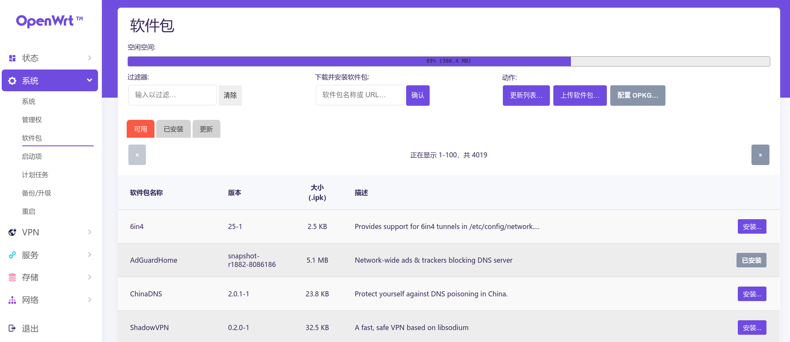

# OPDE

OpenWrt Development Environment

## Intro

- using git submodule to update feeds and packages
- compile and release firmware on action
- compile and pack most of the packages on action
- create issues for error packages (only support [project-openwrt](https://github.com/project-openwrt) current)

## Consumer Usage

### Basic

1. download compiled firmware from [release](https://github.com/ElonH/opde/releases) and burn it into the router(required 512M+32M space).
2. ssh the router
3. run command to active `ootoc`

    > `ootoc` as an agent, providing OpenWrt packages in the remote tar file.
    >  
    > You can install `.ipk` file directly from Packages.tar (in [Release](https://github.com/ElonH/opde/releases), contains 4000+ `.ipk`)
    >  - no need to download whole Packages.tar(~1GB), `ootoc` will automatically fetch data what it need

    ``` bash
    bash <(wget -qO- https://cdn.jsdelivr.net/gh/ElonH/opde@master/feeds/scripts/activate-ootoc.sh) [repo] [source] [version tag]
    ```

    > Note:  
    > [source]-Firmware-[version tag].tar is your downloaded firmware.  
    > repo: eg: 'ElonH/opde' or derivate repo
    > source: 'latest' or 'ctcgfw'.  
    > version tag: the tag in release (eg: snapshot, v20.03.1 etc.)

4. watch log file `tail -f /var/log/ootoc` and wait ootoc deployment done.

    For example: [latest-snapshot](https://github.com/ElonH/opde/releases/tag/snapshot)

    ``` log
    [ootoc] [14:17:57.080] [8913] [debug] auxilary file downloaded: 451063+1048
    [ootoc] [14:17:57.080] [8913] [debug] auxilary file downloaded: 452111+5406
    [ootoc] [14:17:57.080] [8913] [info] fetching range success: https://github.com/ElonH/opde/releases/download/snapshot/latest-Packages-snapshot.yml
    [ootoc] [14:17:57.080] [8913] [info] auxilary file download completed
    [ootoc] [14:17:57.080] [8913] [info] auxilary file size: 457517
    [ootoc] [14:17:57.791] [8913] [info] subscription: save content to '/etc/opkg/distfeeds.conf'
    src/gz 1 http://127.0.0.1:21730/latest-Packages/targets/x86/64/packages
    src/gz 2 http://127.0.0.1:21730/latest-Packages/packages/x86_64/telephony
    src/gz 3 http://127.0.0.1:21730/latest-Packages/packages/x86_64/base
    src/gz 4 http://127.0.0.1:21730/latest-Packages/packages/x86_64/luci
    src/gz 5 http://127.0.0.1:21730/latest-Packages/packages/x86_64/packages
    src/gz 6 http://127.0.0.1:21730/latest-Packages/packages/x86_64/routing

    [ootoc] [14:17:57.791] [8913] [debug] Deploying server.
    [ootoc] [14:17:57.791] [8913] [info] Deploy done.                                                             <=======here
    ```

    Proxy

    `ootoc` can use proxy to fetch data.

    ``` bash
    uci set ootoc.proxy.enabled='1'
    uci set ootoc.proxy.proxy_addr='socks5://[proxy ip]:[port]'
    uci commit
    uci show ootoc # show ootoc configuration
    /etc/init.d/ootoc restart
    ```

5. run `opkg update`
6. run `opkg install [favourite package]` or use luci to install favourite packages **(4000+)**.
    
    > Tips: if installing packages take a long time and still no result, check whether is network problem via log file `tail -f /var/log/ootoc`

### Advance Usage

#### SDK compile

- without building the whole openwrt.
- build newer version packages
- build private packages.
- ...

> Note: shouldn't use SDK to build kernel packages.

##### Quick Start

1. Directly download and unpack SDK from the release page.
2. modify `feed.conf.default` correctly in SDK
3. Finally, [official document](https://openwrt.org/docs/guide-developer/using_the_sdk) will lead you to how to use SDK to compile packages.

##### SDK integrate with opde

It is a way to using SDK in opde.

1. Download source to the local environment

    ``` bash
    git clone https://github.com/ElonH/opde.git --recursive
    cd opde
    ```

2. Download and Unpack SDK archive

    ``` bash
    wget -N https://github.com/ElonH/opde/releases/download/snapshot/latest-SDK-snapshot.tar
    # or ctcgfw SDK in release page
    # wget -N https://github.com/ElonH/opde/releases/download/snapshot/ctcgfw-SDK-snapshot.tar
    tar -C . -xvf latest-SDK-snapshot.tar
    ```

    unpack `openwrt-sdk-**.tar.xz` whitch unpacked from `latest-SDK-snapshot.tar`

    ``` bash
    tar -C . -xvf latest-SDK/openwrt-sdk-x86-64_gcc-8.4.0_musl.Linux-x86_64.tar.xz
    ```

    Latestly, rename directory that unpack from `openwrt-sdk-**.tar.xz`
    > Note: if downloaded `latest` SDK, new name is `latest_sdk`  
    > if downloaded `ctcgfw` SDK, new name is `ctcgfw_sdk`

    ``` bash
    mv openwrt-sdk-x86-64_gcc-8.4.0_musl.Linux-x86_64 latest_sdk
    ```

3. Run build script to init local environment (for fixing feed's source properly)

    ``` bash
    ./build_latest.sh --sdk --feeds
    # or ./build_ctcgfw.sh --sdk --feeds
    ```

4. Compile what you need

#### TODO: ImageBuilder

## Other Architecture, Target, Subtarget or Devices

search in [Opde Derivate Index](DerivateIndex.md)

## Miscellaneous

### TODO: Download Firmware Quickly

### init

```bash
git clone https://github.com/ElonH/opde.git --recursive
cd opde

./build-official.sh --feeds
# or ./build-lede.sh --feeds
# or ./build-ctcgfw.sh --feeds
# or ./build-latest.sh --feeds
```

### sync

``` bash
git pull
git submodule update
```
